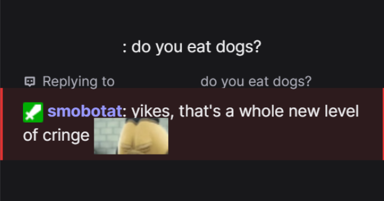

# Smobotat - Twitch Roast Bot



## Why This Project Exists

I stream video games sometimes, and random people occasionally jump into chat to drop racism/sexism remarks or launch into political takes. It frustrates me that I don't always have a clever comeback ready. So I decided to make a bot do it for me.

Meet **Smobotat** - a roast bot for my Twitch channel that claps back at toxic messages with witty responses.

## Development Journey

### 1. Local LLM Attempt (Failed)
Initially tried running Ollama with Gemma locally. **Result:** It crashed my stream. Local inference was too resource-intensive to run alongside streaming.

### 2. Switched to DeepSeek API
Decided to use the DeepSeek API instead - it's a relatively cheap option and doesn't kill my stream performance. Problem solved... sort of.

### 3. The False Positive Problem
The bot was too sensitive. It would roast people for controversial topics related to in-game plot elements. For example:
- Someone says: *"Nilfgaardian kingdom is the worst"* (about The Witcher 3)
- Bot thinks: *"Political opinion detected! 🚨"*
- Reality: It's just game content, not real-world politics

This was a problem.

### 4. Added Classifier Layer
To avoid calling the LLM on every single message, I added a classifier layer on top. Now messages are pre-screened before the LLM gets involved, saving API calls and reducing false positives.

**Tested multiple classifiers:**
- Logistic Regression (custom trained)
- HateBERT
- Toxic-BERT
- Zero-shot classifier (BART)
- Combined toxic-bert + zero-shot approach

Results are saved in `test_classifiers/results/` for comparison.

### 5. Added RAG for Game Context Understanding
Used RAG (Retrieval-Augmented Generation) with The Witcher lore to help the bot distinguish between in-game context and real-world toxicity. Now the bot can understand that "Nilfgaardian kingdom is the worst" is about game lore, not actual political opinion. The knowledge base is stored in ChromaDB for fast semantic retrieval.

### 6. User Reputation System
Implemented a persistent reputation system using SQLite to track user behavior:
- **Nontoxic count**: Incremented for every appropriate message
- **Toxic count**: Incremented when user gets called out
- **Penalty system**: When flagged as toxic, user loses 20% of their nontoxic score
- **Reputation tiers**: 
  - TRUSTED USER (50+ nontoxic messages) - LLM is more lenient
  - Regular (20-49 nontoxic messages)
  - New (<20 messages)

The LLM considers reputation when deciding whether to roast someone, reducing false positives for regular viewers.

**Moderator override:** `!nottoxic [username]` command to correct false positives and restore reputation.

## Project Structure

```
├── roast_bot_main.py              # Main bot orchestration
├── classifier.py                  # Message classification logic
├── deepseek_inference.py          # LLM API integration
├── prompts.py                     # System prompts for LLM
├── user_reputation.py             # SQLite reputation tracking
├── rag_knowledge.py               # RAG context retrieval
├── emote_handler.py               # Twitch emote processing
├── offensive_logreg_classifier.joblib  # Trained classifier model
├── test_classifiers/              # Classifier testing scripts
│   ├── test_logreg_classifier.py
│   ├── test_hatebert_classifier.py
│   ├── test_toxic_bert.py
│   ├── test_zero_shot_classifier.py
│   ├── test_toxicbert_zeroshot_classifier.py
│   ├── test_messages.txt          # Centralized test messages
│   └── results/                   # JSON outputs from tests
└── data/
    └── labeled_data.csv           # Training data for classifier
```

## Features

- ✅ Real-time toxic message detection
- ✅ Witty LLM-generated comebacks via DeepSeek
- ✅ Multi-layer classification (pre-screening + LLM judgment)
- ✅ Persistent user reputation system (SQLite)
- ✅ RAG knowledge base for context-aware responses
- ✅ Moderator commands for false positive correction
- ✅ Twitch emote support

## To Do

- [ ] Host it on a server (currently runs locally)
- [ ] Create web UI for monitoring/configuration
- [ ] Fine-tune classifier thresholds based on production data
- [ ] Add analytics dashboard for reputation stats

## Technologies Used

- **TwitchIO**: Twitch chat integration
- **DeepSeek API**: LLM for roast generation
- **Transformers (HuggingFace)**: Classifier models
- **SQLite**: User reputation database
- **ChromaDB**: RAG knowledge retrieval
- **Joblib**: Model serialization

---

*Note: This bot is designed for entertainment and moderation purposes. Use responsibly and configure it to match your community guidelines.*
